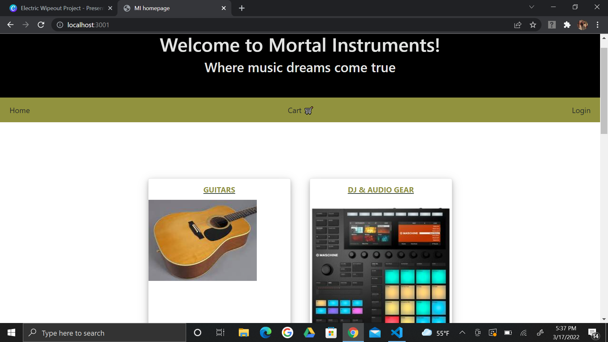
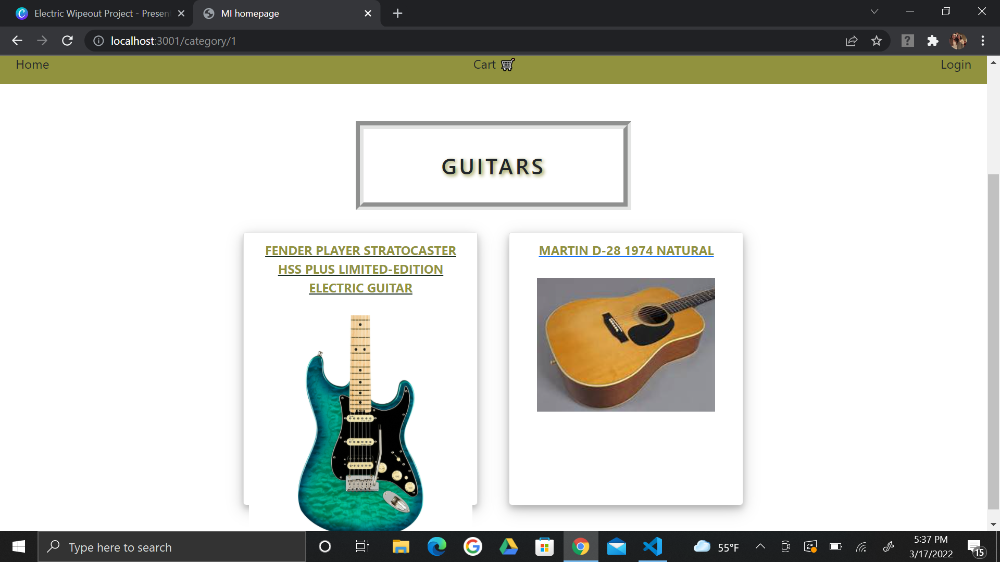
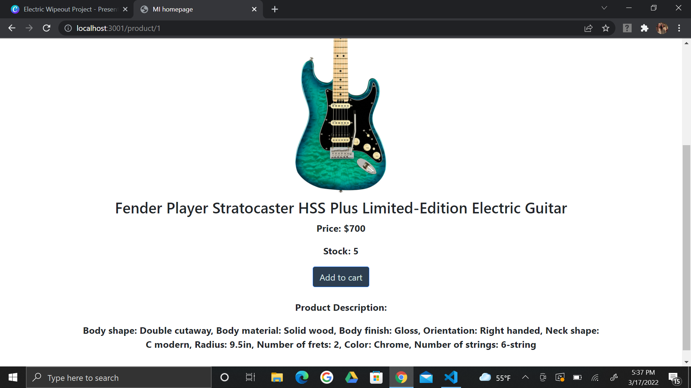
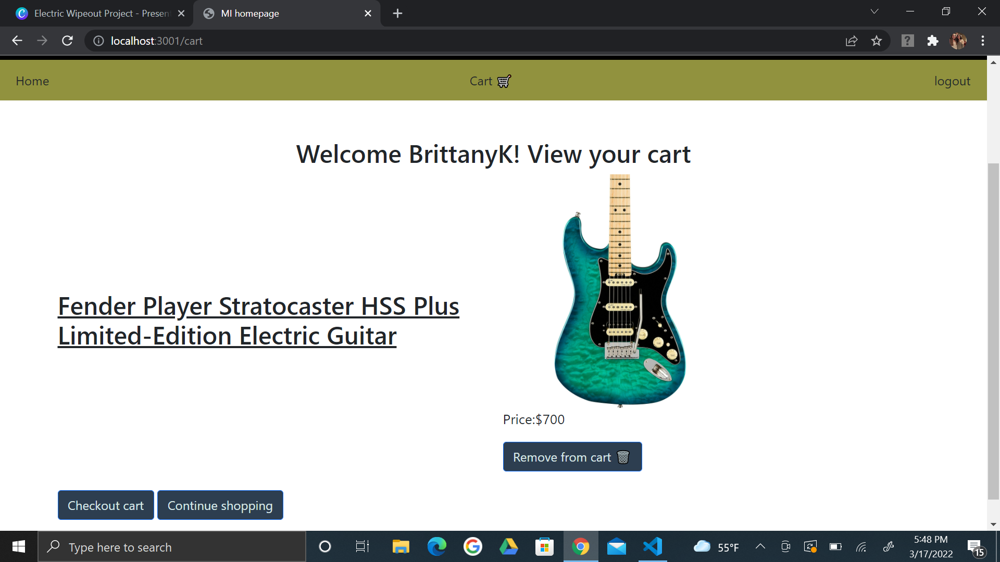
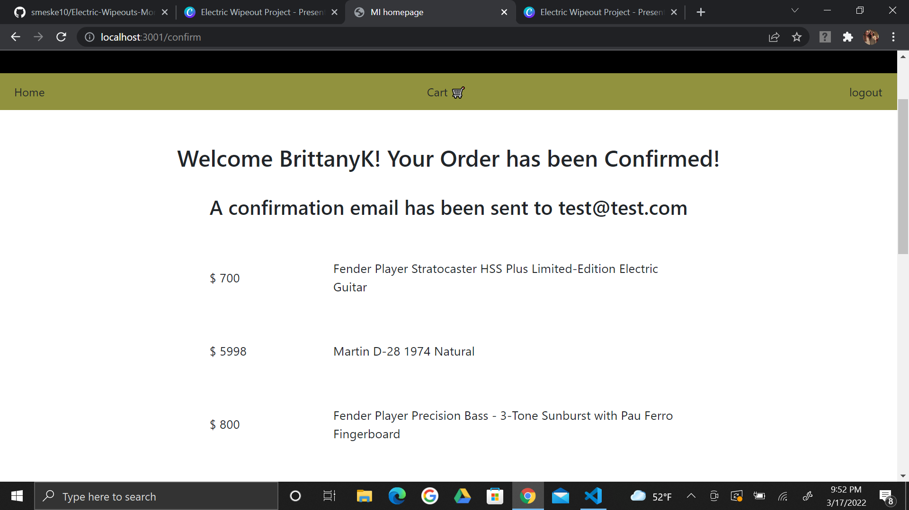

# Project 2: Electric Wipeout's Mortal Instruments

## Description
- This application offers the perfect example of an E-commerce program for a music store. Functionalities of this site enable users to browse through various music categories and products, view individual products, add them to their a cart and checkout. 

## Table of Contents

- [License](#license)
- [Installation](#installation)
- [Usage](#usage)
- [Features](#features)
- [Credits](#credits)
- [Tests](#tests)
- [Questions](#questions)
- [Contribute](#Contribute)

## License

- Unlicensed

Refer to [https://choosealicense.com/](https://choosealicense.com/).

## Installation

To install this application, please follow the steps below:
1. copy or clone this repo to your terminal and open in VSC
2. Run `mysql -u root -p` to `source db/schema.sql`
3. Run `npm i` or `npm install` 
4. Seed the data by running `node seeds/seed.js`
5. Start the terminal in the server.js file. And run `node server.js`
6. Open your default browser and enter `localhost://3001` into the search engine.

- EXTENSIONS:
    - api/cart/:id
    - api/products/:id
    - api/users/:id

## Usage
- This applications follows the model views controllers structure. Using handlebars, Mysql, javascript, routes, and more this website allows users to easily shop and buy online. 
- Refer to the following pictures and linked documentation for visuals and more details! 
- Demo: https://drive.google.com/file/d/1-b81PPyYvQPCJ34VcPLnYUScBp4hm4_9/view
- GitHub: https://github.com/smeske10/Project-2--Electric-Wipeout
- Heroku: https://mortal-instruments-music-shop.herokuapp.com/

## Credits

- This application uses [MySQL2](https://www.npmjs.com/package/mysql2) and [Sequelize](https://www.npmjs.com/package/sequelize) packages to connect your Express.js API to the MySQL database and the [dotenv](https://www.npmjs.com/package/dotenv) package to use environment variables to store sensitive data.

## Questions 

If you have any questions about the repo, open an issue or contact me directly at undefined. You can find more at [smeske10](https://github.com/smeske10/).

## Contribute

- Contact me directly at my GitHub

The [Contributor Covenant](https://www.contributor-covenant.org/) is an industry standard, but you can always write your own if you'd prefer.

